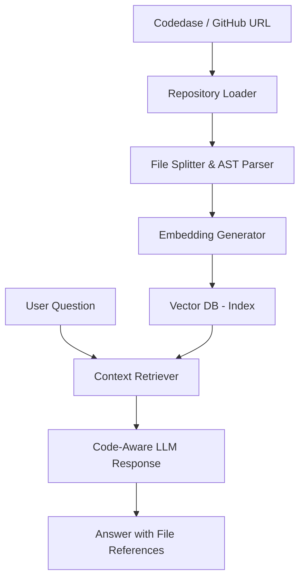

# Project Guide: Codebase Knowledge AI 🧠

## Overview
The **Codebase Knowledge AI** allows developers to chat with their source code. It indexes entire repositories, understands relationships between functions, classes, and modules, and provides high-context answers to complex questions like "Where is the payment logic?" or "How does the auth flow work across these 10 files?"

### Why this project?
- Solves the "onboarding" problem in large engineering teams.
- Demonstrates advanced retrieval strategies (beyond simple text search).
- Shows how to handle structured data (AST) vs. unstructured text.

---

## Tech Stack
- **Languages**: Python
- **Parsing**: `tree-sitter` (for AST parsing) or `langchain-community` loaders.
- **LLM**: OpenAI GPT-4 (high reasoning needed for code analysis).
- **Vector DB**: FAISS (local and fast) or Weaviate.
- **Framework**: LangChain or LlamaIndex.

---

## Architecture



---

## Implementation Steps

### 1. Repository Indexing
You need to load the files while preserving metadata (filename, path, line numbers).
- Use `GenericLoader.from_filesystem` in LangChain.
- **Pro Tip**: Ignore `.gitignore` files like `node_modules`, `build`, and `.git` to save tokens.

### 2. Intelligent Chunking
Standard text splitting often breaks code logic.
- Use a `Language-specific splitter` (e.g., `RecursiveCharacterTextSplitter.from_language(Language.JS)`).
- This ensures classes and functions stay together in the same chunk.

### 3. Adding AST (Abstract Syntax Tree) Context
To really "understand" code, the AI needs to know the relationships.
- Use `tree-sitter` to extract a list of all function signatures and their imports.
- Inject this "repo map" into the LLM context so it knows which file calls which.

### 4. Vector Search with Metadata
Store chunks in FAISS with metadata.
- When the user asks about "Login", retrieve chunks from `auth.py`, `login_controller.ts`, and `schema.sql`.

### 5. Chat Engine
Implement a RetrievalQA chain with memory.

```python
from langchain.chains import ConversationalRetrievalChain

chain = ConversationalRetrievalChain.from_llm(
    llm=ChatOpenAI(model="gpt-4"),
    retriever=vector_db.as_retriever(),
    return_source_documents=True
)
```

---

## Key Challenges
- **Large Repos**: Indexing 1 million lines of code is expensive. *Solution*: Index only the signatures first, then retrieve specific file bodies as needed (Two-stage retrieval).
- **Stale Index**: Code changes every minute. *Solution*: Implement a webhook to re-index only the changed files on every `git push`.

## Future Enhancements
- **Multi-Repo Search**: Ask questions across different microservices.
- **PR Reviewer**: Use the knowledge base to automatically review Pull Requests and flag deviations from existing patterns.
- **IDE Plugin**: Integrate directly into VS Code as a sidebar assistant.

## Future Enhancements (Phase 6+)

### Phase 6 — Multi-Repo Search
- Input: list of repo paths or GitHub URLs
- Change: ingestion.py accepts array of repos, tags each 
  chunk with repo_name in metadata
- Change: retriever.py filters by repo_name if specified
- No changes to Phase 1-5 core

### Phase 7 — PR Reviewer
- Trigger: git diff output or GitHub webhook payload
- New file: src/pr_reviewer.py
- Uses existing retriever from Phase 4
- Compares PR diff chunks against indexed patterns
- Output: structured JSON with flagged deviations

### Phase 8 — VS Code Plugin
- New folder: vscode-extension/
- Wraps main.py as a local HTTP server (FastAPI)
- VS Code sidebar calls localhost API
- Completely separate from core src/